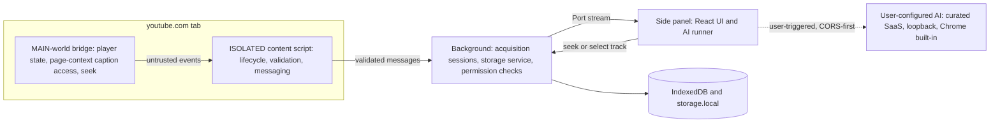

# Transcript Extension: Research, Architecture, and Implementation Plan (Revision 2)

Planning pass only. Nothing was implemented, built, tested, or submitted. The workspace `k:\yt_extension\yt_transcriber` is an empty git repo (no commits, remote `koko-88/yt_transcriber`). The reference repo was audited read-only in a temp folder.

Revision 2 re-examined eight review issues and the whole plan for internal consistency. Part A records the assessment, Part B lists problems found independently, Part C is the complete revised plan, Part D is the decision register, Part E is the M0 validation matrix, Part F is the consistency check.

Status labels used everywhere:
- FINAL: decided on current evidence; changing it needs new evidence, not a spike.
- PROVISIONAL: default chosen; an M0 item confirms or flips it with a stated rule.
- OPEN: no default; needs product-owner input or M0 output before implementation of the affected milestone.

---

# Part A. Review issues: assessment

## Issue 1. Acquisition over-specified before M0

- Validity: **valid, and stronger than stated.** Revision 1 called S1 (`getPlayerResponse()` baseUrl + `fmt=json3`) the primary path and claimed it was "verified by asbplayer for pot-gated videos". That attribution was wrong.
- Evidence: asbplayer PR #978 (merged 2026-05-02) says the fix is to "prefer YouTube's **initialized player** caption track URLs ... because they can include runtime POT params **missing from static player responses**", then normalize to `srv3` and add `c=WEB`. The static player response (which `getPlayerResponse()` returns) is exactly what lacks `pot`. youtube-transcript-api #592: `exp=xpe` URLs return an empty HTTP 200 without a video-bound `pot`; cookies do not help. Non-web InnerTube clients return `LOGIN_REQUIRED` bot checks (asbplayer, lifesized). One MCP project claims an IOS-client path still works; evidence conflicts and that path violates our principle anyway.
- Underlying problem: the plan fused three different things: the principle (where requests may originate), the candidate mechanisms, and the one that actually works. Only the principle is decidable without M0.
- Alternatives: (1) keep S1 primary and patch later; (2) declare the principle FINAL and the ladder OPEN, with M0 comparing candidates on a defined sample with a decision rule; (3) pick the passive/player-initialized path as primary now.
- Tradeoff: (1) risks building M2 around a path that returns empty bodies on a growing share of videos; (3) guesses on the other side (the internal API it needs is unverified, and passive capture needs caption activity). (2) costs about one extra spike week and removes the guess.
- Recommendation: option 2. See revised sections 11, 12, 13, 24, 25, 30–31 and M0-A.
- Status: principle **FINAL** (D07); mechanism and ladder order **OPEN until M0-A** (D08); `TranscriptSource.method` and `Availability` enums **PROVISIONAL** (D09b).

## Issue 2. Backend, telemetry, and V1.x inconsistency

- Validity: **valid.** Revision 1 said "no backend in V1/V1.x" while also planning V1.x telemetry to an "own minimal endpoint", remote JSON config, and a Strict-mode switch that "disables update/config fetch".
- Underlying problem: "backend" was undefined, so anything hosted by a third party or served as static JSON slipped through. Also, extension updates are fetched by the browser, not the extension; Strict mode cannot and should not claim to control them.
- Definition adopted: a **backend** is any network endpoint that the extension contacts and that is operated by us or by a processor on our behalf (own server, serverless function, static config host, analytics/error SaaS, licensing/payment provider). Not a backend: youtube.com requests made within the user's own page session; the AI provider the user configured (the user's processor, not ours); browser/store update infrastructure; maintainer-side CI jobs that send no user data.
- Alternatives: (a) V1.x telemetry via own endpoint; (b) V1.x telemetry via third-party privacy analytics; (c) no operator endpoints until V2, with observability from local diagnostics, user-shared reports, and maintainer canaries; (d) remote config for kill switches.
- Tradeoff: (a)/(b) give failure-rate visibility but make V1.x a backend product (privacy policy, CWS disclosure, AMO `technicalAndInteraction`, operations). (d) shortens incident response but the ladder already falls through on validation failure, so a remote switch adds little and adds a backend plus review scrutiny. (c) costs visibility; mitigated by diagnostics copy and canaries.
- Recommendation: **V1: zero operator endpoints (FINAL). V1.x: zero by default; telemetry OPEN with an explicit approval rule; remote config rejected for V1/V1.x (FINAL). V2: first backend (licensing processor, optional hosted AI).** See sections 18, 20, 27, 28, 33, 34.
- Status: D16a FINAL, D16b OPEN, D16c FINAL.

## Issue 3. AI provider host permissions

- Validity: **valid.** `optional_host_permissions: https://*/*` is broader than any V1 feature needs.
- Current behavior (evidence):
  - Chrome: extension pages and the service worker bypass CORS only for origins with host permission; without it, normal CORS applies and a server that returns `Access-Control-Allow-Origin` still works. Optional host permissions are not shown at install; a runtime request shows "Read and change your data on <host>", which overstates a plain API call. `permissions.request` needs a user gesture.
  - Firefox: MV3 host permissions are user-revocable at any time; optional ones are requested at runtime from a user gesture and manageable in about:addons.
  - Chrome Local Network Access: extensions are currently exempt ("extensions that have the necessary host permissions are allowed to make local network requests"); without host permission, loopback requests proceed and are readable if the server sends CORS headers.
  - Ollama: allows only `127.0.0.1`/`0.0.0.0` origins by default and rejects `chrome-extension://`/`moz-extension://` **server-side**; the user must set `OLLAMA_ORIGINS` (PR #6010 to allow extensions by default was not merged; issue #15680 is open). Host permission does not fix a server-side 403.
  - LM Studio: CORS is a server toggle (off by default).
  - Tor Browser proxies localhost by default (`network.proxy.allow_hijacking_localhost`), so loopback models are unreachable there.
  - Major SaaS APIs (OpenAI, OpenRouter, Gemini OpenAI-compatible endpoint, Groq, Mistral) are used from browsers today, which implies CORS support, but this is per-provider and must be verified (M0-D). Anthropic requires the `anthropic-dangerous-direct-browser-access` header.
- Alternatives: (1) keep broad optional pattern, request exact origin at setup; (2) curated provider allowlist + loopback in `optional_host_permissions`, CORS-first with exact-origin grant only as fallback, custom HTTPS endpoints deferred; (3) CORS-only with no host permissions at all; (4) arbitrary custom endpoints in V1 in CORS-only mode.
- Tradeoff: (1) maximal flexibility, broadest declared scope, CWS review questions likely, misleading prompts. (3) least privilege but LM Studio/llama.cpp without CORS would fail. (4) no manifest scope but lets an imported/tampered config send keys anywhere; low V1 demand. (2) covers the realistic V1 audience with a small declared list and an honest fallback.
- Recommendation: option 2 for V1; custom HTTPS endpoints in V1.x as CORS-only (no broad pattern) unless demand shows CORS-less gateways. See sections 16, 21, 22 and M0-D.
- Status: V1 scope D17 PROVISIONAL (per-provider CORS matrix); custom endpoints deferred D17b FINAL for V1.

## Issue 4. `unlimitedStorage` decided before evidence

- Validity: **partially valid.** The decision lacked sizing and the stated reason ("quota") was the wrong one. The permission itself likely survives, for a different reason.
- Size estimates (to be measured in M0-E):
  - English speech 140–160 wpm: about 9k words/hour, about 50–55 KB UTF-8 text/hour. Arabic letters are 2 bytes in UTF-8: about 90–110 KB/hour.
  - Segments: manual tracks about 800–1,200/hour; ASR json3 windows about 1,000–1,800/hour after collapsing word events. Compact offsets add about 15–30 KB/hour.
  - Stored transcript: about 70–130 KB/hour; a 3-hour ASR transcript about 0.2–0.4 MB (English), up to about 0.7 MB (Arabic). Revision 1's "3-hour ASR about 30k segments" was inflated; 30k stays only as a word-level stress case (about 1.5 MB).
  - 500 saved videos averaging 40 minutes: about 25–45 MB. Notes/highlights/tags for thousands of items: under 2 MB. Recents cache (200 items): about 10–20 MB. AI cache: capped (default 50 MB). Library search index: built in memory on demand, not persisted in V1.
  - Heavy user: about 50–120 MB. Typical user (under 50 saved): under 10 MB.
- Quota and eviction:
  - Chrome: `storage.local` is 10 MB without the permission (we keep only settings there, so irrelevant). Extension-origin IndexedDB uses the shared quota (large on normal disks). Without `unlimitedStorage`, eviction under storage pressure has been reported for extension origins.
  - Firefox: `storage.local` is IndexedDB-backed. Without `unlimitedStorage`, extension data is best-effort and subject to whole-origin LRU eviction under disk pressure (documented quota manager behavior; uBO's author cites this as the reason for declaring it). With it, storage is treated as persistent. `navigator.storage.persist()` from an extension page may show a separate prompt.
  - Install UX: Firefox shows "Store unlimited amount of client-side data". Chrome shows no warning for it (confirm in M0-C). Adding it in a later Firefox update triggers a permission prompt that blocks auto-update until accepted, so the decision should be made before V1.
- Classification: **necessary for durability of user-authored data (notes, highlights, saved library), not for quota.**
- Recommendation: include in V1 by default; drop it only if M0-E shows extension storage is already persistent without it in both browsers (via `navigator.storage.persisted()` and forced-pressure tests) and `persist()` is silent. Storage meter and backup export remain regardless.
- Status: D13 **PROVISIONAL (default include)**.

## Issue 5. API-key storage threat model

- Validity: **valid.** Encrypting with a key stored beside the ciphertext protects against nothing; revision 1 admitted "obfuscation" but still described it as encryption, which invites false assurance.
- New evidence: content scripts can read `storage.local` by default in both browsers. Chrome has recently allowed `storage.local.setAccessLevel('TRUSTED_CONTEXTS')`; Firefox does not implement it for `local`. Extension-origin IndexedDB is unreachable from content scripts in both browsers.
- Threat-by-threat model (control, and what remains true):
  - Web pages, including youtube.com: cannot access extension storage or messages. Keys never enter MAIN or ISOLATED contexts; no message to a content script carries a key.
  - Compromised youtube.com renderer impersonating our content script: could read `storage.local` and send runtime messages. Keys are not in `storage.local`; background handlers reject secret-bearing or AI-executing requests from senders with `sender.tab` set.
  - Other extensions and websites via messaging: `externally_connectable` not declared; `onMessageExternal` not registered.
  - Compromised extension (malicious update, supply chain): total loss; mitigated only by supply-chain controls (section 22). Stated honestly.
  - Local profile access (another OS account, stolen unencrypted disk, profile backups): plaintext key is readable from profile files. Optional "Don't remember this key" keeps it only in `storage.session` (in-memory); users are advised to use spend-limited, provider-scoped keys and OS disk encryption.
  - Malware running as the user: can read the profile, keylog, or modify the browser. No extension-level control is effective. Stated honestly.
  - Exports/backups: secrets never exported; import ignores and strips secret fields; exports are plaintext and labelled as such.
  - Logging/diagnostics: secrets use a branded `Secret` type whose serialization is `[redacted]`; `Authorization` headers never logged; diagnostics include provider type only.
  - Telemetry: none in V1 (D16a).
  - Browser sync: secrets never in `storage.sync`; IndexedDB and `storage.local` are not synced by Chrome or Firefox Sync.
  - Config tampering (malicious import, UI mistake): a key is bound to the origin it was entered for; changing a provider's base URL clears its key.
- Alternatives: (a) same-profile "encryption" (rejected: cosmetic); (b) plaintext in extension-origin IDB with trusted-context-only access plus a session-only option; (c) passphrase-derived key (WebCrypto PBKDF2, AES-GCM), unlocked per browser session; (d) OS keychain via native messaging (rejected: native host install, store friction).
- Tradeoff: (c) gives real at-rest protection against offline profile theft but not against malware, and adds unlock UX and a lost-passphrase failure mode. (b) is honest and simple.
- Recommendation: (b) in V1 (FINAL); (c) as an optional V1.x "lock" only if users ask for it (OPEN). Copy: "Stored unencrypted in the extension's private database. Websites and page scripts cannot read it. Anyone who can read your browser profile or run software as you can."
- Status: D15a FINAL, D15b OPEN.

## Issue 6. Tor stance

- Validity: **partially valid.** Revision 1's conclusion (do not recommend) was right, but "not supported, reject" conflated compatibility, support, distribution, and recommendation.
- Evidence: Tor Browser stable 15.x is based on Firefox ESR 140; Tor Browser 16 alpha is rebased on ESR 153. Both meet our Firefox minimum (140). Tor Browser runs in permanent private browsing; the Tor Project and Privacy Guides strongly discourage additional add-ons (unique fingerprint, attack surface). Localhost is proxied by default, so local AI is unreachable. The AMO listing is installable in Tor Browser and we should not try to block that.
- Graded stance:
  - Technically compatible: expected, **unverified**, checked in M0-J.
  - Manually characterized: yes, best-effort in M0 and at each Tor Browser major release; results published in the FAQ.
  - Officially supported: **no.** No CI, no release gate, no fix commitment for Tor-only issues.
  - Distributed for Tor: **no** separate build or listing.
  - Recommended for anonymity-sensitive users: **no**, explicitly discouraged in copy.
- Known consequences to document: extension presence changes fingerprint relative to other Tor users; YouTube can detect our DOM changes (in-player button is off by default); remote AI providers link transcripts to the user's account and API key regardless of Tor; local AI unreachable without weakening proxy settings (we will not advise that); "Safest" security level disables JavaScript and breaks YouTube.
- Status: D21a stance FINAL; D21b characterization results PROVISIONAL (M0-J). Mullvad Browser gets the same stance.

## Issue 7. Package manager and AMO rationale

- Validity: **valid on rationale, not on outcome.** Revision 1 said Bun was rejected because "AMO's builder runs Node 24 + npm and looks for `build-for-amo`". That overstated AMO's requirements.
- What AMO actually requires (source-code submission policy): source for any minified/bundled/generated code; step-by-step build instructions that produce byte-identical output; open-source, locally runnable build tools; dependencies from official registries with lockfiles. Reviewers use a default environment (Ubuntu 24.04 ARM64, Node 24.x, npm 11.x) **unless the developer specifies another** (for example, AMO-reviewed projects document pnpm environments).
- What is convenience only: the automatic source builder (announced 2026) that runs on Node LTS, uses a `build-for-amo` npm script if present, and fast-tracks review when output matches. Nothing found says it handles Bun, pnpm, or Yarn lockfiles.
- Comparison:
  - npm: ships with Node; matches the reviewer default; highest chance of matching the automatic builder; `npm ci` is deterministic from `package-lock.json`. Weakness: tolerant hoisting (phantom deps), slower installs.
  - pnpm: strict layout prevents phantom deps; fast; used by the WXT project itself. Reviewers must install it (Corepack is no longer bundled from Node 25); automatic-builder support unknown.
  - Bun: fastest; text `bun.lock` since 1.2; WXT works with it. Reviewers must install it; automatic-builder support unknown. Its runtime is unused if it only installs packages.
- Recommendation: **npm stays** for fast-path AMO review with no reviewer setup and one fewer tool in CI. Mitigations: pin Node 24 LTS (`.nvmrc`, `engines`), pin npm via `packageManager`, `npm ci` only, lint for undeclared imports, and verify byte-identical output on the reviewer environment in M0-H.
- Status: D05a FINAL (npm); D05b PROVISIONAL (byte-identical build, M0-H).

## Issue 8. Frozen decisions vs M0

- Validity: **valid.** Revision 1's "decisions not to revisit" froze items that its own M0 was meant to test: acquisition mechanism, `scripting` + MAIN injection method, `unlimitedStorage`, exact-origin AI permissions, and Firefox host-permission UX.
- Recommendation: replace the frozen list with the decision register in Part D. Every PROVISIONAL or OPEN item names its closing evidence and M0 item, and milestones declare which decisions they depend on.
- Status: done in Parts D and E.

---

# Part B. Independently discovered problems

1. **MAIN-world "random token" is not a security boundary.** The page shares the MAIN world and can read or hook anything our bridge does. Fix: treat all MAIN-world data as untrusted input (validate, size-cap, display-only); no privileged action is derived from it. The token is dropped from the security claims (section 22).
2. **Injecting the bridge via `scripting.executeScript` at `document_idle` misses early player requests**, which passive-capture candidates need. Fix: declare the MAIN-world bridge as a manifest content script (`world: "MAIN"`, `document_start`); keep `scripting` only for re-injecting into tabs that were open at install or update (Chrome does not inject manifest content scripts into existing tabs). Confirmed in M0-C (sections 13, 21).
3. **Strict mode claimed to disable "update/config fetch".** Extension updates are browser-controlled. The claim is removed and Strict mode is redefined (section 18).
4. **AI runner in the background service worker is fragile.** Chrome terminates a service worker when a `fetch()` response takes more than 30 seconds to arrive and caps single operations at about 5 minutes. Local models on long prompts routinely exceed 30 seconds to first byte. Fix: AI requests run in the panel document (an extension page that lives while the user watches the result); completed map-reduce chunks are cached so a re-run resumes. "Resumable interrupted jobs" removed. PROVISIONAL, M0-D (sections 10, 16, 24).
5. **Segment estimate was inflated** (30k segments for 3 hours). Corrected to about 3–6k; 30k kept as a stress target (sections 14, 19, M3).
6. **Firefox `data_collection_permissions` listed `technicalAndInteraction` for telemetry that V1 does not have**, and treated BYOK transmission as "verify later". Mozilla defines transmission as data handled outside the add-on or the local browser; sending transcripts to a remote AI provider is `websiteContent` transmission. Fix: V1 declares `required: ["none"], optional: ["websiteContent"]`, requested at AI setup; `technicalAndInteraction` is added only if telemetry is approved. Whether loopback providers count is confirmed in M0-I (section 18).
7. **Private/incognito windows were unaddressed.** Automatically recording recents from private windows writes browsing activity to persistent storage. Fix: no automatic recents or history from private/incognito tabs; explicit Save is still allowed with a notice. Firefox requires the user to allow the extension in private windows. Relevant for Tor (permanent private browsing). M0-L (sections 13, 18).
8. **Fingerprinting via `web_accessible_resources`.** Firefox's per-install `moz-extension` UUID becomes a stable identifier if any resource is web-accessible. Fix: declare no WAR; the build is checked for WXT-emitted WAR. The in-player button (DOM injection) is off by default (sections 14, 22).
9. **Live canary on GitHub-hosted runners is likely unreliable.** Datacenter IPs hit consent walls and bot checks, and there is no signed-in coverage. Status OPEN, M0-K; fallback is a maintainer-run weekly script (section 25).
10. **Test claims beyond tooling reach.** The fixture server cannot reproduce YouTube's `pot` gating (server behavior); it only verifies our mapping of recorded responses. "No request leaves in Strict mode, verified by E2E network capture" is only feasible on Chromium, and only for pages Playwright observes. Fix: claims rewritten per layer; Firefox Strict-mode egress is checked manually with the devtools network panel or a local proxy (section 25).
11. **`activeTab` was declared in V1 only for V1.x embeds.** Fix: removed from the V1 manifest; added in V1.x. It carries no warning, so adding it later has no update friction (section 21).
12. **`m.youtube.com` host permission is unnecessary for a desktop side-panel product.** Firefox for Android has no sidebar and is not a V1 target. Fix: V1 host permission is `https://www.youtube.com/*` only (section 21).
13. **"Chrome 148+ ships `browser`; set minimum accordingly" contradicted `minimum_chrome_version: 128`.** WXT's `browser` export works on older Chrome without the polyfill. Fix: the minimum is chosen by API needs and test commitment, not the namespace. PROVISIONAL, M0-G (sections 5, 6).
14. **"Firefox parity on day one" was a false parity claim.** Core transcript and workspace features have parity; AI local options differ (no Firefox built-in model; loopback needs user server configuration), no-caption transcription is never on Firefox, and sidebar semantics differ. Positioning copy corrected (section 2).
15. **The "reliability under PO gating" differentiator depended on unvalidated acquisition.** It is now conditional on M0-A (section 2).
16. **Firefox MV3 host permissions are revocable after install.** Onboarding must detect a missing youtube.com grant (`permissions.contains`) and re-request it from a gesture (sections 13, 21, M0-C).
17. **`captions-disabled-by-owner` may be indistinguishable from `no-captions`.** Merged unless M0-A finds a reliable signal. Added `live-in-progress`, `upcoming`, `needs-player-interaction` (section 12).
18. **CSP `connect-src https:` was broader than the V1 provider scope.** It is narrowed to curated origins plus loopback in V1 (page-context YouTube requests are not governed by extension CSP) (section 22).
19. **Recents semantics were unclear** (metadata only or full transcript cache). Defined: metadata plus cached transcript, pruned, clearable, never from private windows (sections 18, 19).
20. **Firefox test matrix omitted the minimum version.** Development uses Firefox 147+ (WXT MV3 dev mode) while the target minimum is 140. Fix: manual acceptance on current release plus current ESR (153) plus a smoke test on 140 while it remains supported (section 25).

---

# Part C. Revised plan

## 1. Executive recommendation

- Build a fresh, single-codebase WXT + React + strict TypeScript extension whose primary surface is the Chrome side panel / Firefox sidebar, scoped to desktop YouTube (`www.youtube.com`) in V1.
- Acquisition principle (FINAL): transcripts are obtained only within the user's YouTube tab, using YouTube's own web player state and session as the page itself would. No extension-origin or server-side YouTube requests, no alternate client identities, no PO-token minting, no stream download, no persistence of session material.
- Acquisition mechanism (OPEN until M0-A): M0 compares candidate in-page mechanisms on a defined sample. M2 implements the ladder the M0 report selects.
- Local-first: transcript, search, export, notes, highlights, and saved library work with no network beyond the YouTube page. V1 contacts **no operator-run endpoint**. AI is optional BYOK/local, runs from the panel, and uses a curated provider list plus loopback.
- Reference repo `ANcpLua/yt-transcript` (MIT) is reference-only, porting parser test vectors and the fixture-server pattern with attribution.
- Browsers: Chrome and Firefox first-class; Brave via the Chrome Web Store with manual acceptance. Tor Browser: not supported, not recommended for anonymity, characterized best-effort.
- No-caption audio transcription: V2, Chromium-only, behind a spike.

## 2. Product positioning and differentiation

Positioning: "The private transcript workspace for YouTube: your data stays on your device, your AI is your choice."

- Table stakes: transcript, timestamps, click-to-seek, search, copy, TXT/SRT export, one-click AI summary.
- Differentiators:
  - Reliability of acquisition within the page, **conditional on M0-A**. The claim appears in copy only if the selected ladder meets the M0 thresholds on gated videos.
  - Local-first with a verifiable Strict local mode and no operator backend in V1.
  - BYOK + local models with grounded, timestamp-cited answers.
  - Firefox support at launch for core transcript and workspace features. AI options differ: there is no built-in Firefox model, and loopback models need user server configuration. No-caption transcription is never available on Firefox.
  - Account-free research workflow: library, highlights, notes, tags, Markdown with deep links.
  - Long-video handling: virtualization, hierarchical summaries, BM25 retrieval.
- Not differentiating on: summary gimmicks, mind maps, quizzes/flashcards, meeting transcription, multi-platform.

## 3. Competitive findings

- The market is crowded with AI-summary-first extensions; free tiers are quota-limited because AI runs on vendor servers.
- Common 2026 user complaints: empty transcripts (PO gating), "sign in to confirm you're not a bot" (non-page fetches), breakage after YouTube UI changes.
- Few support Firefox; almost none support local models; none advertise a verifiable local-only mode.
- Store facts: "YouTube" in the product name triggers trademark takedowns; keyword-chain descriptions are rejected as spam.

## 4. Requirements vs assumptions

- A. Requirements: Chrome, Brave, Firefox; single codebase; never fake availability; local core without account; least privilege; public store distribution; production quality.
- B. Strong preferences (accepted): side panel primary; WXT/React/TS/Tailwind/Vitest/Playwright; local-first; canonical model.
- C. Hypotheses:
  - Browser-side discovery instead of a backend scraper: principle validated; mechanism unvalidated (M0-A). Native TextTracks are not used by YouTube.
  - Playwright for all browsers: Chromium only.
- D. Needs validation: no-caption transcription (V2 spike); Tor (characterization only); hosted AI (V2); sync (V2+); telemetry (OPEN).

## 5. Critical assumptions challenged

- TextTrack/VTTCue on YouTube: false. YouTube renders captions in DOM spans; `video.textTracks` is empty.
- "`getPlayerResponse()` fixes staleness and gating": fixes SPA staleness only. Its `baseUrl` is the static URL that may lack runtime `pot`, so gating is not addressed (M0-A).
- activeTab-only for a YouTube companion: wrong (click per tab). Use a single-site host permission.
- "Playwright covers Firefox": no.
- "Tor via Firefox is free": compatibility is plausible, but recommendation for anonymity is not; see graded stance.
- "webextension-polyfill needed": no; archived 2026-07-30, and WXT's `browser` export works across supported versions.
- "Bun is disallowed by AMO": false. AMO allows specified environments; npm is kept for the automatic-builder fast path and the zero-setup reviewer default (Issue 7).
- "Encrypted API keys": false as implemented in revision 1; replaced with an honest model (section 22).
- "A background service worker is a good place for long AI calls": false on Chrome (30-second response-arrival limit).

## 6. Recommended technology stack

- Framework: WXT 0.21.x (single entrypoint generates Chrome `side_panel` and Firefox `sidebar_action`; Firefox sources zip; `wxt submit` for CWS v2, AMO, Edge). PROVISIONAL on M0-G.
- UI: React 19, Tailwind CSS v4 (CSS variables, logical properties), `@tanstack/react-virtual`, `zustand`.
- Language: strict TypeScript (`strict`, `noUncheckedIndexedAccess`, `exactOptionalPropertyTypes`).
- Validation: zod v4 (`zod/mini` in size-sensitive bundles; none in the MAIN-world bridge).
- Storage: `storage.local` (non-secret settings, small indices), `storage.session` (ephemeral per-tab state, session-only secrets), IndexedDB via `idb` (library, secrets, AI cache) with numbered migrations.
- Messaging: thin typed bus with zod envelopes and sender-class checks (or `@webext-core/messaging`; decided in M1).
- Search: own normalizer (Arabic/diacritics/CJK); `minisearch` BM25 for Q&A retrieval.
- Tests: Vitest + `WxtVitest` + `@webext-core/fake-browser`; Playwright (Chromium); `web-ext lint`/`run` for Firefox.
- Tooling: npm (pinned via `packageManager`), Node 24 LTS (`.nvmrc`, `engines`), `npm ci`, ESLint (typescript-eslint strict-type-checked, react-hooks, jsx-a11y, import/no-extraneous-dependencies, boundaries), Prettier.
- Minimum versions (PROVISIONAL, M0-G):
  - Chrome: `minimum_chrome_version: 128`. It must be at least 116 for `sidePanel.open`; 128 is the oldest version we commit to test. Built-in AI is feature-detected (138+).
  - Firefox: `strict_min_version: 140` (built-in data-consent UI; MAIN world and optional host permissions since 128).

## 7. Alternatives considered and rejected

- Plasmo (maintenance mode), CRXJS (no Firefox sources zip/submit), hand-rolled Vite/esbuild with three manifests, Preact/Solid/Svelte, Dexie (heavier than needed).
- pnpm/Bun: technically viable and AMO-permissible; not chosen because the automatic AMO builder and reviewer default are npm-based (Issue 7).
- Embedding RAG in V1, Sentry SDK.
- Same-profile key "encryption"; OS keychain via native messaging.
- Remote config / kill switch in V1/V1.x.
- Backend scraper, yt-dlp service, PO-token minting, spoofed InnerTube clients (in page or background).

## 8. Open-source repository audit (ANcpLua/yt-transcript, MIT, v3.3.0)

Unchanged from revision 1 in substance:
- Scope: a generic media-page tool with a YouTube fallback adapter.
- Extraction ladder L0–L5: activeTab injection, TextTrack, network interception, parsers, then the YouTube adapter. The adapter makes an in-page `POST /youtubei/v1/player` with spoofed ANDROID_VR/IOS contexts; there is also a background InnerTube cycle that strips `exp=xpe` and sets ineffective User-Agent headers.
- Build and permissions: three hand-maintained manifests; broad optional host permissions; global fetch/XHR monkeypatching.
- Tests and code quality: thin tests plus a useful HTTPS fake-youtube.com fixture server; `sidepanel/App.tsx` is a 63 KB monolith; custom build; bun/node dual toolchain.
- MIT: attribution in `THIRD_PARTY_NOTICES.md`.
- New note: its spoofed-client player POST is excluded by our acquisition principle and is not an M0 candidate.

## 9. Build-vs-fork recommendation

- C: fresh architecture, reference-only, plus targeted B (parser vectors, fixture-server pattern) with attribution. FINAL.
- A (fork) rejected: different scope, build, UI monolith, excluded acquisition paths, no community to inherit.

## 10. Browser compatibility architecture

- One codebase; `import.meta.env.FIREFOX/CHROME` plus a small `platform/` layer:
  - `platform/panel.ts`: Chromium `sidePanel.setPanelBehavior({openPanelOnActionClick:true})`, with `sidePanel.open({tabId})` called synchronously in gesture handlers. Firefox `sidebarAction.toggle()` in `action.onClicked`. The Firefox sidebar is per-window, so the panel follows the active tab in both browsers.
  - `platform/background.ts`: Chromium service worker vs Firefox event page. Listeners are registered synchronously; state lives in `storage.session`. The background holds no long-running work.
  - `platform/permissions.ts`: request/contains wrappers; detects revoked host permission (Firefox).
- Brave: Chromium build from CWS; manual acceptance; Shields does not affect in-page youtube.com requests (confirm in M0-A).
- Browser-specific, isolated: panel opener; `browser_specific_settings.gecko`; storage persistence semantics; AI local options; audio capture (V2 Chromium).



## 11. Transcript acquisition architecture

Layered as principle, candidates, then the validated ladder.

- Principle (FINAL, D07):
  - Every YouTube request is issued by, or within, the user's YouTube tab using YouTube's own web client state.
  - The extension may read page and player state, observe the page's own youtube.com caption responses, and trigger YouTube UI features the user could trigger, restoring any state it changes.
  - Forbidden: extension-origin/background YouTube requests, alternate client identities (ANDROID/IOS/TV contexts, in page or not), PO-token minting, stream download, persisting cookies/`pot`/`visitorData`/request URLs.
- Candidate mechanisms compared in M0-A (none is "primary" yet):
  - C1 Static track URL: `#movie_player.getPlayerResponse()` (fallbacks: `yt-navigate-finish` payload, first-load `ytInitialPlayerResponse`) supplies `captionTracks[].baseUrl`. Fetch from page context with `fmt=json3` or `srv3` and `c=WEB`. Expected to work on ungated videos and return an empty 200 on `exp=xpe`-gated ones.
  - C2 Player-initialized track URL (asbplayer approach): read caption track URLs from the initialized player or captions module, which carry the runtime `pot`. Which internal API exposes them, and whether it is populated without captions ever being enabled, is unverified.
  - C3 Observe the player's own request: capture YouTube's own timedtext response on youtube.com only, when captions are active. Variant C3b programmatically enables the chosen track via the player API to trigger the player's own request, then restores the user's caption state. M0 measures side effects: visible flash, persisted caption preference, and requests.
  - C4 `pot` reuse: apply the `pot` observed in C2/C3 (bound to the video) to other tracks or `tlang` translations of the same video.
  - C5 YouTube's own transcript feature: open "Show transcript" and read the panel DOM, or observe the web client's own transcript response. Consider this YouTube-UI-coupled; language choice may be limited.
- Selection rule for the M0 report:
  - The primary is the candidate with the highest success on the gated sample and no user-visible side effects.
  - Fallbacks are ordered by success rate, then brittleness.
  - C3b is allowed only if caption state is fully restored.
  - If no candidate reaches the gated threshold (Part E, M0-A), V1 ships an explicit "Load via captions" flow (user turns captions on and C3 captures), and the reliability claim is removed from positioning.
- Invariants regardless of mechanism:
  - An empty body, or a body with no events or text, on an HTTP 200 is `fetch-empty`, never `no-captions`.
  - Every stage validates shape and size before success.
  - A stale `videoId` discards the result.
  - Stages are bundled code (no remote logic); a local debug setting can disable a stage.
- Abstraction: `TranscriptProvider { detectVideo, listTracks, fetchTrack, seek, subscribePlayback }` in `providers/youtube`. Core, UI, storage, and AI depend only on the canonical model and `AcquisitionResult`. FINAL.

## 12. Canonical transcript/domain model

- Core shapes FINAL (D09a):
  - `VideoMetadata { provider; videoId; canonicalUrl; title; channelName?; channelId?; durationMs?; thumbnailUrl?; chapters?; liveState?: 'none'|'live'|'upcoming'|'post-live'; capturedAt }`
  - `TranscriptTrack { trackId; languageCode; languageLabel; kind: 'manual'|'asr'|'translated'; translatedFrom?; isDefaultForVideo?; sourceRef?: opaque, session-only, never persisted }`
  - `TranscriptSegment { index; startMs; endMs; text; speaker? }`
  - `Transcript { id: 'youtube:<videoId>:<trackId>'; schemaVersion; video; track; segments; source; acquiredAt; textHash }`
  - `Paragraph` is a derived view (not persisted).
  - `AcquisitionResult = { ok: true; transcript; tracks } | { ok: false; reason: Availability; retryable; diagnostics: StageTrace[] }`. The UI can never render a transcript from a non-ok result.
  - `AppError { code; retryable; userMessageKey; context (redacted); cause? }`
- Enums PROVISIONAL (D09b, finalized in the M0 report):
  - `TranscriptSource.method`: one value per shipped candidate (for example `yt-static-url`, `yt-player-url`, `yt-player-observed`, `yt-transcript-panel`). `format: 'json3'|'srv3'|'vtt'`.
  - `Availability`: `available | no-captions | login-required | age-restricted | members-only | live-in-progress | upcoming | not-a-video-page | fetch-empty | needs-player-interaction | parse-failed | unsupported-page-structure | network-error | unknown`. `captions-disabled-by-owner` is merged into `no-captions` unless M0-A finds a reliable signal.

## 13. YouTube SPA/lifecycle strategy

- Content scripts: ISOLATED controller plus MAIN-world bridge, both declared in the manifest for `https://www.youtube.com/*` (bridge `world: "MAIN"`, `document_start`, idempotent guard). PROVISIONAL (M0-C).
- `scripting.executeScript` re-injects into tabs open at install or update when the browser does not do it itself.
- Navigation: `yt-navigate-start`/`yt-navigate-finish`, `yt-page-data-updated`, URL polling fallback. `videoId` comes from `/watch?v=`, `/shorts/<id>`, `/live/<id>`.
- Sessions keyed by `(tabId, videoId)` with a stale guard; `timeupdate` throttled to about 250 ms.
- Paused or unplayed videos: supported if the selected ladder does not require playback or caption activity (M0-A). Otherwise the panel shows `needs-player-interaction` with a one-click action.
- Shorts, live, and premieres: behavior is measured in M0-A.
  - Shorts: the separate Shorts player may not expose tracks.
  - Live in progress maps to `live-in-progress`; upcoming premieres map to `upcoming`.
  - Post-live and post-premiere videos are treated as VOD once tracks exist.
- Signed-in vs signed-out: the page session is used inherently. Nothing session-derived is read into extension contexts or persisted. M0-A measures differences, for example members-only and age-gated videos.
- Host permission revoked (Firefox, and Chrome site access settings): the panel detects it and shows a one-click re-grant from a gesture.
- Private/incognito tabs: acquisition works; nothing is written automatically. Recents and history are skipped; explicit Save shows a notice.
- MV3 restarts: session state in `storage.session`; panel re-hydrates on mount.
- Other edge cases: EU consent wall, region block, unlisted, playlists (`list` ignored), miniplayer/inline previews (always `#movie_player`), Music/Kids excluded, embeds V1.x.

## 14. UX architecture

- Side panel/sidebar app with routes Transcript, Library, Notes, AI, Settings; options page mounts Settings.
- Openers: toolbar action, keyboard command. The in-player button is an optional setting, **off by default** (fewer DOM dependencies, less detectable); on Firefox it shows a hint if the gesture does not propagate (M0-B).
- Widths 320–600 px; themes; RTL and Arabic locale from V1; keyboard navigation; ARIA; WCAG AA.
- Performance: realistic 3-hour ASR transcript (about 3–6k segments) interactive in under 150 ms after load; 30k-segment stress case under 300 ms.
- Offline: everything except acquisition and remote AI.

## 15. Feature prioritization

- Must-have (V1): auto-detect; readable transcript; timestamps; click-to-seek; active highlight; follow toggle; search with RTL-aware normalization; track selector (manual/ASR/translated where offered); paragraph and raw modes; copy variants; TXT/MD/SRT/VTT/JSON export; honest availability states with diagnostics.
- High-value (V1): saved library and recents; notes and highlights; tags and favorites; Library search; backup export/import (no secrets); themes; Arabic/RTL; shortcuts; BYOK/local AI (summary, takeaways, chapters, grounded Q&A) for curated providers, loopback, and Chrome built-in; Strict local mode.
- V1.x: embedded players (activeTab); paste URL; custom HTTPS AI endpoints (CORS-only); optional passphrase lock (if D15b approved); study notes/glossary; export presets; watch map; bulk library export. Telemetry only if D16b is approved.
- V2+: first operator backend (licensing, hosted AI); Chromium live transcription; encrypted sync; more platforms; embeddings; speaker labels.
- Rejected: quizzes/flashcards, bilingual workflows, mind maps, social, audio-file drop, bulk playlist/channel scraping, sentiment/topics.
- Small additions: copy link at timestamp, jump to now, per-segment menu, print stylesheet, storage meter.

## 16. AI architecture

- Adapter: `AiProvider { id; capabilities; chat(request, {signal}) -> AsyncIterable<Delta> }`. V1 implementations: `openai-compatible`, `ollama-native` (model listing), `chrome-builtin` (Summarizer/Prompt API, feature-detected, hardware-dependent).
- V1 provider catalog (PROVISIONAL, M0-D): OpenAI, OpenRouter, Groq, Mistral, and Google Gemini (OpenAI-compatible endpoint) as SaaS; loopback targets are Ollama, LM Studio, llama.cpp server, and local vLLM. Anthropic is included only if its browser-access header path passes M0-D; otherwise V1.x.
- Network access policy:
  - CORS-first: call the provider from the panel without host permission.
  - If a curated or loopback origin fails CORS, offer "Grant access to <origin>" from a gesture: an exact-origin `permissions.request` against the declared optional list.
  - Ollama shows `OLLAMA_ORIGINS` setup guidance, since a server-side 403 is not fixable by permission. LM Studio shows "Enable CORS" guidance or uses the loopback grant.
- Custom HTTPS endpoints: V1.x, CORS-only, key bound to origin. No broad `https://*/*` unless V1.x demand shows CORS-less gateways (then re-evaluated with a CWS justification).
- Execution context: requests run in the panel document, not the background (Chrome's 30-second response-arrival and 5-minute limits). Closing the panel cancels. Completed map-reduce chunks are cached so re-runs resume. PROVISIONAL (M0-D).
- Secrets: read from the secrets store only in extension pages; never sent to content scripts.
- Pipelines, context strategy (full transcript up to about 24k tokens, else BM25 + hierarchical), grounding with citation validation, cache `(transcriptHash, pipeline, providerModel, promptVersion)` with a 50 MB LRU, prompt-injection isolation (no tools, sanitized Markdown), low-temperature defaults: unchanged.
- Consent: first remote AI use discloses provider and data. On Firefox it also requests optional `websiteContent` data-collection consent (M0-I confirms whether loopback needs it).
- Monetization: V1 free; V2 decided with D28.

## 17. No-caption transcription recommendation

- Chromium: `tabCapture` + offscreen + transformers.js Whisper (WebGPU) or Prompt API audio; real-time only.
- Firefox: not feasible (no tab audio capture).
- Tor: not applicable (not supported; Firefox limits apply).
- Recommendation: V2, Chromium-only, explicit "Transcribe as it plays", optional permissions at first use, preceded by a spike. PROVISIONAL (D22).

## 18. Privacy/data architecture

- Network egress by version:
  - V1: (1) YouTube caption and page requests within the user's tab (inherent to viewing YouTube); (2) user-triggered requests to the AI provider the user configured. Nothing else; no operator endpoint.
  - V1.x: the same, plus custom endpoints the user configures. Telemetry only if D16b is approved, which would make it the first operator endpoint and require an updated policy and disclosures.
  - V2: licensing processor, optional hosted AI gateway, optional sync.
- Never leaves the device: library, notes, highlights, tags, settings, secrets (except to their own provider origin), browsing history.
- Strict local mode (definition FINAL, default OPEN):
  - Allows only Chrome built-in and loopback AI; blocks all other extension-initiated network requests, enforced in a single fetch gate used by every extension-origin request.
  - It cannot and does not affect YouTube's own page traffic or browser-managed extension updates, and copy says so.
- Private/incognito: no automatic recents or history; explicit Save with notice.
- Firefox manifest (V1): `data_collection_permissions: { required: ['none'], optional: ['websiteContent'] }`. `technicalAndInteraction` is added only with approved telemetry. The key cannot be removed once shipped; values can evolve (M0-I confirms).
- CWS privacy tab: website content, user-initiated transmission to the user-chosen AI provider; Limited Use statement.
- Retention: recents are metadata plus cached transcript (default 200 items or 90 days); saved items are never auto-deleted; AI cache LRU; Clear all data; backup reminder before uninstall where possible.
- Sync (V2+): `storage.sync` only for non-secret settings; E2E-encrypted blobs for content; never secrets.

## 19. Storage architecture

- `storage.local`: versioned non-secret settings, provider configs without keys, small library summary. Kept under 1 MB.
- `storage.session`: per-tab acquisition sessions, panel state, session-only secrets.
- IndexedDB (`idb`, extension origin): `transcripts` (one record per transcript, compact offsets + text blob), `videos`, `notes`, `highlights`, `tags`, `recents`, `aiCache`, `secrets` (accessed only from extension pages and background, never proxied to content scripts), `meta`.
- Sizing: section A-Issue 4 estimates; typical under 10 MB, heavy 50–120 MB (M0-E measures).
- `unlimitedStorage`: included for durability (eviction exemption and Firefox persistent treatment), PROVISIONAL per D13.
- Quota handling: `navigator.storage.estimate()` before large writes; AI cache and recents evicted first; "Library full" state with prune suggestions.
- Migrations: numbered, idempotent, fixture-tested; settings mirrored with `settingsVersion`.
- Lifecycle: migrations under a lock at background start; uninstall clears everything; corrupted state is quarantined and repaired ("Library repaired").
- Backups: JSON with schema version, zod-validated on import, size-capped. Secrets are never exported and are stripped on import. The file is plaintext and labelled so in the UI.

## 20. Backend/SaaS recommendation

- Definition: see Issue 2.
- V1: **zero operator endpoints** (FINAL).
- V1.x: zero by default.
  - Telemetry is OPEN (D16b). If approved, it is one stateless ingest endpoint or a privacy-analytics processor that receives only aggregate outcome counters. It is opt-in, blocked by Strict mode, and requires the Firefox `technicalAndInteraction` optional permission, a CWS disclosure update, and a privacy policy update.
  - Remote config is rejected (FINAL).
- V2 (if monetizing, D28):
  - Licensing via a payments/licensing processor (ExtensionPay/crxbase-style) is the first backend.
  - Optional hosted AI: a serverless modular monolith (auth, usage, ai-proxy, per-user quotas, no transcript logging).
- V2+: encrypted sync if demand is proven.
- Feature flags: build-time and local settings only through V1.x.

## 21. Permissions matrix (V1 unless noted)

- `storage`: all browsers; settings/library; mandatory; install-time; no warning.
- `unlimitedStorage`: all browsers; durability of user-authored data. Mandatory if D13 holds. No Chrome warning (verify, M0-C); Firefox install line "Store unlimited amount of client-side data". Adding it later on Firefox blocks auto-update until the user accepts, so it is decided pre-V1.
- `sidePanel`: Chromium only; Firefox uses the `sidebar_action` key.
- `scripting`: all browsers; re-injection into already-open YouTube tabs after install/update. PROVISIONAL (M0-C: dropped if both browsers re-inject manifest content scripts, or if orphan recovery via "reload tab" prompt is acceptable).
- `host_permissions: https://www.youtube.com/*`: all browsers; auto-detect, bridge, in-page caption access.
  - Chrome: install-time.
  - Firefox 127+: shown and granted at install but revocable; runtime check and re-request.
  - `m.youtube.com` dropped.
- `optional_host_permissions`: `https://api.openai.com/*`, `https://openrouter.ai/*`, `https://api.groq.com/*`, `https://api.mistral.ai/*`, `https://generativelanguage.googleapis.com/*`, `http://localhost/*`, `http://127.0.0.1/*`.
  - Fallback only, for CORS-failing curated or loopback origins; exact-origin request from a gesture.
  - Final list PROVISIONAL (M0-D), including port matching for loopback patterns.
  - No `https://*/*` in V1.
- `commands` key: shortcut; no permission.
- Not in V1:
  - `activeTab` (V1.x embeds).
  - `tabCapture`/`offscreen` (V2 Chromium, optional).
  - `tabs`, `<all_urls>`, `webRequest`, `cookies`, `history`, `clipboardRead`, `identity`, `declarativeNetRequest`.
- Manifest also declares:
  - no `web_accessible_resources`;
  - no `externally_connectable`;
  - `incognito: "spanning"` (Chrome default), with private-window behavior per section 13.

## 22. Threat model and security architecture

- MAIN world is untrusted and shared with the page.
  - The bridge sends plain events; no secret token is claimed.
  - ISOLATED validates shape and size (8 MB body, 100k segments) and never executes page-provided strings.
  - Commands to MAIN (seek, track select) carry no sensitive data.
- Message spoofing: the background classifies senders.
  - Content script: `sender.tab` present, `sender.id === runtime.id`, URL on youtube.com.
  - Extension page: extension-origin URL, no tab.
  - Secret access and AI execution are extension-page-only. Content-script requests are limited to acquisition/session messages.
  - zod per message; unknown types dropped and counted.
- XSS: React text rendering; sanitizing Markdown allowlist (no HTML, no `javascript:`, links only to YouTube timestamps); sanitized filenames; validated, capped imports.
- Secrets: threat-by-threat model in Issue 5.
  - Storage: extension-origin IDB, trusted contexts only.
  - Options: session-only option; origin-bound keys; redaction via the `Secret` type.
  - Never included in exports, sync, or diagnostics.
  - Honest copy about profile and malware limits.
- Transcript leakage: single fetch gate enforcing Strict mode and the provider allowlist; no telemetry in V1; AI only on user action.
- Prompt injection: section 16.
- Fingerprinting: no WAR; in-player button off by default; no globals left in MAIN world beyond a namespaced guard.
- CSP (extension pages): `script-src 'self'; object-src 'self'`; `connect-src 'self'` plus curated provider origins plus `http://localhost:* http://127.0.0.1:*`. Broadened only with V1.x custom endpoints. No remote code, no `eval`.
- Supply chain: pinned lockfile, `npm ci`, `npm audit`, Renovate weekly grouped, dependency allowlist review, no git-URL dependencies, license check. A compromised release is a total-loss scenario for secrets, so this is also the key-protection control.
- Release integrity: tagged releases, checksums, changelog, staged CWS rollout.

## 23. Store/distribution strategy

- Chrome Web Store:
  - Trademark-safe name ("... for YouTube™" only in description) and single-purpose statement.
  - Privacy tab: website content; user-initiated AI transmission.
  - Limited Use policy URL; per-permission justifications, including the optional AI origins and `unlimitedStorage`.
  - 2026-08-01 policy enforcement (strict necessity, prominent disclosure).
  - CWS API v2 (v1 stops 2026-10-15).
- Brave: from CWS; manual acceptance.
- Firefox AMO:
  - Extension id; `data_collection_permissions` per section 18; listed channel; expect human review.
  - Source zip with `build-for-amo` script and a README stating the environment (Node 24 LTS, npm pinned).
  - Byte-identical output verified in M0-H.
- Tor Browser: no separate distribution; FAQ states the graded stance (Issue 6) and known limitations.
- Edge: OPEN (D30).
- Manual-only steps: account creation, first listings, AMO bootstrap before `wxt submit`, questionnaires, screenshots, trademark disputes, review responses, payments KYC.

## 24. Reliability/failure model

- YouTube structure or gating change: the stage fails validation and the next stage runs; if all fail, the result is `unsupported-page-structure` or `fetch-empty` with a copyable stage trace.
- Detection comes from user diagnostics and canaries (D27). Response is a hotfix release (CWS review typically hours to days; AMO variable).
- A local debug toggle disables a stage for affected users. There is no remote kill switch (D16c).
- Empty success (HTTP 200 with no events) is `fetch-empty`, with the next stage attempted; never shown as no captions.
- Captions unavailable, login, age, members-only, live, or upcoming: explicit states; no retry loops.
- Malformed captions: partial plus warnings; zero segments is `parse-failed`.
- Track disappears: refresh list, fall back with a notice.
- Video change mid-extraction: stale guard.
- Background restart: session rehydration. AI is unaffected because it runs in the panel. Closing the panel cancels AI; cached chunks survive.
- Storage pressure: estimate, evict caches, show Library-full state; `unlimitedStorage` for durability.
- AI errors: typed `AiError` (`auth | rate-limit | network | cors | origin-rejected | model | context-too-large`). Backoff only for network and rate-limit; never silently switch providers. `origin-rejected` shows Ollama/LM Studio setup guidance.
- Permission revoked: the feature is disabled with a re-grant affordance.
- Corrupted state: quarantine and repair; the panel never crashes.

## 25. Testing strategy

Each layer states what it can and cannot prove.

- Unit (Vitest + fake-browser): parsers, paragraphing, normalization, exporters (golden), schemas, error mapping, migrations, AI pipelines with a fake provider (chunking, citations, injection), fetch-gate/Strict-mode logic, secret redaction, sender-class checks.
- Integration (Vitest, DOM env): acquisition state machine over recorded responses. Cases: manual, ASR, translated, no captions, empty-200 gated body, login, age, live, upcoming; SPA sequences; stale guard.
  - Proves our mapping of known response shapes. Does not prove YouTube's gating behavior.
- E2E Chromium (Playwright + HTTPS fixture server impersonating www.youtube.com): panel open, detect, render, seek, search, switch track, save, export, unavailable states, background restart, AI permission denial, Strict-mode egress on the panel page via Playwright request events.
  - Proves extension wiring against a stub player. Does not prove real player internals or `pot` behavior.
- Firefox: `web-ext lint` gating; `web-ext run` smoke; manual acceptance.
  - Browsers: current release, current ESR (153), and 140 while supported.
  - Strict-mode egress verified manually via devtools network or a local proxy.
  - Optional non-gating automation per M0-F.
- Brave: manual per release.
- Live YouTube: the M0-A manual matrix, then a maintainer canary (environment per D27, non-gating, alerts only). This is the only layer that exercises real gating.
- Contract tests: recorded SSE for the OpenAI-compatible and Ollama adapters; built-in AI mocked.
- Tor Browser: optional manual characterization per major release; never a release gate.
- Manual release checklist: Chrome, Brave, Firefox (release and ESR) on Windows and macOS; signed-in and signed-out; private window; RTL; dark; 3-hour video; panel widths; keyboard-only; permission revoked.

## 26. CI/CD strategy

- PR gates:
  - `npm ci`, ESLint, Prettier, `tsc --noEmit`, Vitest with coverage thresholds on `core/`.
  - Chrome and Firefox builds, `web-ext lint`, Playwright Chromium.
  - `npm audit --audit-level=high`; bundle budgets (panel under 400 KB gzipped, content under 60 KB, MAIN bridge under 20 KB).
  - Manifest assertions: permission set equals the approved list; no WAR; no `externally_connectable`.
  - License check.
- Release: tag builds chrome, firefox, and sources zips plus `SHA256SUMS` and a GitHub Release. Submission is a separate manual dispatch (`wxt submit`) with environment-protected secrets and staged CWS rollout.
- Reproducibility job: rebuilds the Firefox zip from the sources zip in a clean Node 24/npm container and diffs the output (M0-H decides the ARM64 check).
- Secrets never in repo; Renovate weekly.

## 27. Observability strategy

- V1 (no backend):
  - Local redacted ring log (500 events).
  - Debug mode showing the stage trace.
  - "Copy diagnostics": browser, versions, stage outcomes, error codes; no content, IDs, or secrets.
  - GitHub issue template for pasting diagnostics.
  - Store reviews and dashboards; maintainer canary.
- V1.x: unchanged unless D16b approves opt-in aggregate counters (outcome by stage and `Availability`, browser family/version, extension version), with no IDs or text, blocked by Strict mode.
- V2: the backend has its own service metrics; no transcript logging.

## 28. Roadmap

- Foundation (expensive to change): canonical model and result types; provider boundary; message bus with sender classes; storage schema with a separate secrets store; fetch gate; platform layer; i18n/RTL/theming; error taxonomy; permission model; CI gates; fixture server.
- V1: section 15 must-have and high-value; Chrome, Brave, Firefox; zero operator endpoints.
- V1.x: embeds (activeTab), paste URL, custom HTTPS AI endpoints, optional passphrase lock (D15b), study notes/glossary, export presets, watch map, bulk export. Telemetry only via D16b.
- V2+: first backend (licensing, hosted AI), Chromium live transcription, encrypted sync, more platforms, embeddings.
- Rejected or deferred: official Tor support, quizzes/flashcards, bilingual, mind maps, bulk scraping, audio-file transcription, social features, spoofed-client or server-side scraping, remote config.
- Dependencies:
  - M2 depends on the M0-A report; M5 depends on M0-D and M0-I; M6 depends on M0-H and M0-I.
  - Telemetry (if approved) needs the consent UX and a policy update.
  - V2 hosted AI needs licensing first.

## 29. Repository/module architecture proposal

Single WXT app (npm workspaces only when a backend exists: `apps/extension`, `apps/api`, `packages/core`).

```
src/
  core/            # pure TS: model, parsers, paragraphs, search, export, errors, i18n keys
  providers/
    youtube/       # bridge (MAIN), controller (ISOLATED), candidate stages, availability mapping
  platform/        # panel opener, permissions, storage adapters, messaging bus, fetch gate, logger
  background/      # acquisition sessions, storage service, migrations bootstrap, re-injection
  storage/         # idb schema, repositories (incl. secrets), migrations/NNN_*.ts
  ai/              # providers/, pipelines/, prompts/, grounding/, cache, runner (panel-side)
  ui/              # React app
  entrypoints/     # background.ts, youtube.content.ts, youtube-bridge.content.ts (MAIN), sidepanel/, options/
public/_locales/   # en, ar
test/              # fixtures, e2e/, fixture-server/
docs/              # ADRs, threat model, privacy policy source, listings, release checklist, M0 report
```

Rules: `core` imports nothing from platform/ui/providers; `providers` imports `core` only; `ui` reaches background only via the bus; `storage/secrets` importable only from extension-page and background code (lint-enforced). FINAL (D24).

## 30–31. Implementation milestones with acceptance criteria

- M0 Validation (2–3 weeks; throwaway spike code outside `src/`)
  - Scope: Part E items M0-A to M0-L.
  - Completion: a written report that records a result for every matrix item and closes or re-labels every PROVISIONAL/OPEN decision in Part D with the stated rule.
- M1 Foundation (depends on D02, D03, D05a, D23)
  - Scope: scaffold; core model and parsers; error taxonomy; redacting logger with the `Secret` type; bus with sender classes; storage v1 including the secrets store; fetch gate; platform layer; i18n; CI gates; manifest assertions; fixture server skeleton.
  - Acceptance: CI green; unpacked builds load on Chrome and Firefox; `web-ext lint` clean; budgets and manifest assertions enforced.
- M2 Acquisition (depends on the M0-A report; D07, D08, D09b, D10, D11)
  - Scope: the M0-selected ladder behind `TranscriptProvider`; manifest MAIN bridge; state machine; track listing; `Availability` mapping incl. empty success; SPA lifecycle; stale guard; revoked-permission handling; private-window rules; session persistence; seek/playback.
  - Tests: integration on recorded fixtures; Chromium E2E on the fixture server.
  - Manual: the M0-A live sample subset on Chrome, Brave, Firefox, signed-in and signed-out.
  - Acceptance: every `Availability` state reachable on fixtures; zero false "available"; live sample success within 5 points of the M0 result; fixture time-to-transcript median under 1.5 s.
- M3 Transcript UX
  - Scope: as section 14/15 must-have.
  - Acceptance: axe checks pass; realistic 3-hour transcript under 150 ms, 30k stress under 300 ms; exports byte-stable.
- M4 Local workspace (depends on D13, D25)
  - Scope: library, recents (no private-window writes), notes, highlights, tags, search, backup (no secrets), retention, meter, clear-all.
  - Acceptance: 500-item library loads under 500 ms; invalid or oversized imports rejected; exports contain no secret fields (test).
- M5 AI (depends on M0-D, M0-I; D15a, D17, D18, D19, D20)
  - Scope: adapters; curated catalog; CORS-first with exact-origin fallback; Ollama/LM Studio guidance; secrets store UX with session-only option; panel-side runner with chunk cache; Strict gate; pipelines; citation validation; streaming; consent incl. Firefox `websiteContent`.
  - Tests: fake-provider pipelines, injection fixtures, citation validator, recorded SSE contracts, fetch-gate unit tests, Chromium panel egress E2E.
  - Manual: provider matrix on Chrome and Firefox; Firefox Strict egress via devtools or proxy.
  - Acceptance: no non-loopback request in Strict mode (Chromium E2E plus Firefox manual); invalid citations never render as valid; a key is never sent to an origin other than the one it was entered for (test).
- M6 Hardening and store readiness (depends on M0-H, M0-I)
  - Scope: security review vs section 22; permission audit; privacy policy + Limited Use; listings; AMO reproducibility on the declared environment; release and submit workflows; checklist; notices; Tor FAQ.
  - Acceptance: reproducible build diff empty on the declared environment; `wxt submit --dry-run` passes; checklist signed off.
- M7 V1.x: activeTab embeds, paste URL, custom HTTPS endpoints (CORS-only), passphrase lock if D15b is approved, study notes/glossary, presets, watch map; telemetry only if D16b is approved.
- M8 V2: first backend (licensing, optional hosted AI), Chromium live transcription spike then build, sync design.

## 32. Key risks and mitigations

- No in-page candidate meets the gated threshold: ship the "Load via captions" flow, drop the reliability claim, and revisit the positioning pitch (M0-A decision rule).
- A candidate relies on undocumented player internals (C2/C3b): isolate it per stage, validate, fall through, use the diagnostics trace, keep the hotfix path.
- Store rejection: single-site host permission, narrow optional list, drafted disclosures, trademark-safe naming.
- Firefox E2E gap: manual matrix, lint, optional automation per M0-F.
- Local AI friction (Ollama origins, LM Studio CORS, Firefox has no built-in model): guided setup copy, "Test connection" diagnostics, honest capability matrix per browser.
- Data loss: `unlimitedStorage` (D13), backup export, meter.
- Secret exposure beyond the stated model: honest copy, session-only option, spend-limited key guidance, supply-chain controls.
- Scope creep: reject list and decision register.
- Trademark/ToS perception: the principle in section 11; no downloading, circumvention, or spoofing.

## 33. Open questions for the product owner

- Product name and domain (Firefox id, policy URL, listing). D32.
- Monetization intent and timing (drives V2 backend). D28.
- Locales beyond English and Arabic.
- Strict local mode default for new installs. D19b.
- Telemetry in V1.x: never, or opt-in aggregate counters under the D16b rule.
- Appetite for YouTube-UI-coupled acquisition (C5) if M0 ranks it as the only gated-path fallback.
- Edge listing at V1. D30.
- Publisher identity for stores.
- Passphrase lock for secrets in V1.x. D15b.

## 34. Decisions the implementation agent should not revisit

Only FINAL items from Part D are frozen: D01, D03, D04a, D05a, D06a, D07, D09a, D10a, D12, D14, D15a, D16a, D16c, D17b, D19a, D21a, D24, D25, D26, D29. PROVISIONAL items may change only through the M0 report's stated rule. OPEN items block their dependent milestone until closed.

## 35. Final recommended next step

Approve revision 2, then answer D32 (name/domain) and D19b (Strict default). After that, run M0 in a separate pass in this order:
1. M0-A acquisition, which gates M2 and the positioning claim.
2. M0-C permissions and injection, and M0-D AI connectivity.
3. The rest in parallel.

M1 scaffolding starts only after the M0 report closes D02, D05b, D08, D10b, D11, D13, D17, D18, and D23.

---

# Part D. Decision register

Format: ID. Decision. Status. Evidence to close (M0 item).

- D01. Fresh architecture; reference repo for parser vectors and fixture pattern only, MIT attribution. FINAL.
- D02. WXT 0.21.x as the framework. PROVISIONAL. Closes when WXT generates a correct `side_panel`/`sidebar_action`, a Firefox sources zip, a MAIN-world content script entry, and no stray WAR, and when the output loads on Firefox 140 and current ESR (M0-G).
- D03. React 19, Tailwind v4, strict TS, zod v4, `idb`, zustand. FINAL.
- D04a. Vitest + fake-browser for unit/integration; Playwright on Chromium for E2E. FINAL.
- D04b. Firefox automation approach (web-ext + WebDriver BiDi, harness, or manual only). OPEN (M0-F).
- D05a. npm with lockfile, Node 24 LTS pinned. FINAL (rationale per Issue 7).
- D05b. Byte-identical AMO build on the declared environment, and whether the automatic builder matches. PROVISIONAL (M0-H).
- D06a. Side panel/sidebar primary; no popup. FINAL.
- D06b. In-player opener button (off by default; gesture behavior per browser). PROVISIONAL (M0-B).
- D07. Acquisition principle (section 11). FINAL.
- D08. Acquisition candidates selected and ladder order. OPEN (M0-A, decision rule in section 11).
- D09a. Core domain shapes and the non-ok-never-renders rule. FINAL.
- D09b. `TranscriptSource.method` and `Availability` members. PROVISIONAL (M0-A).
- D10a. Single host permission `https://www.youtube.com/*`; `m.youtube.com` dropped. FINAL.
- D10b. Manifest-declared MAIN-world bridge at `document_start`. PROVISIONAL (M0-A shows whether any selected candidate needs early execution; M0-C confirms behavior in both browsers).
- D11. `scripting` permission for re-injection on install/update. PROVISIONAL (M0-C orphan behavior per browser).
- D12. No `activeTab` in V1 (added in V1.x for embeds). FINAL.
- D13. `unlimitedStorage` in V1. PROVISIONAL, default include. Dropped only if M0-E shows persistence without it in both browsers and no prompt from `persist()`.
- D14. Storage layout: settings in `storage.local`, ephemeral state in `storage.session`, library and secrets in extension IDB. FINAL.
- D15a. Secrets model: plaintext in extension-origin IDB, trusted contexts only, session-only option, origin-bound, never exported, synced, or logged, honest copy. FINAL.
- D15b. Optional passphrase lock (V1.x). OPEN (user demand after V1; product-owner decision).
- D16a. V1 has zero operator endpoints. FINAL.
- D16b. V1.x opt-in aggregate telemetry. OPEN. Approval rule: the product owner approves, and V1 diagnostics and canaries prove insufficient to see failure rates by browser and stage.
- D16c. No remote config or kill switch in V1/V1.x. FINAL.
- D17. V1 AI provider catalog and optional-origin list; CORS-first with exact-origin fallback. PROVISIONAL (M0-D per-provider and per-browser matrix).
- D17b. No arbitrary custom HTTPS endpoints and no `https://*/*` in V1. FINAL.
- D18. AI requests executed in the panel document with chunk cache. PROVISIONAL (M0-D: more than 30 s to first byte and more than 5 min streams, panel vs service worker, both browsers).
- D19a. Strict local mode definition and fetch-gate enforcement. FINAL.
- D19b. Strict local mode default for new installs. OPEN (product owner).
- D20. Firefox `data_collection_permissions` values (`none` + optional `websiteContent`) and whether loopback AI requires consent. PROVISIONAL (M0-I).
- D21a. Tor stance: not supported, not distributed separately, not recommended for anonymity; characterized best-effort. FINAL.
- D21b. Tor Browser characterization results and FAQ content. PROVISIONAL (M0-J).
- D22. No-caption transcription V2, Chromium-only. PROVISIONAL (V2 spike).
- D23. Minimum versions: Chrome 128, Firefox 140. PROVISIONAL (M0-G API audit and test-matrix commitment).
- D24. Module boundaries enforced by lint. FINAL.
- D25. Private/incognito policy: no automatic recents or history; explicit save with notice. FINAL (M0-L verifies mechanics only).
- D26. No `web_accessible_resources`, no `externally_connectable`. FINAL.
- D27. Live canary environment (GitHub-hosted, self-hosted residential, or maintainer-run). OPEN (M0-K).
- D28. Monetization and V2 backend timing. OPEN (product owner).
- D29. Brave via CWS with manual acceptance only. FINAL.
- D30. Edge listing at V1. OPEN (product owner).
- D31. Extension CSP `connect-src` narrowed to curated origins plus loopback. PROVISIONAL (follows D17).
- D32. Product name and domain. OPEN (product owner; blocks the Firefox id and listings, not M0).

---

# Part E. M0 validation matrix

Each item lists browsers, sample, method, metrics, exit rule, and decisions closed. The browsers are Chrome stable, Brave stable, Firefox release, and Firefox ESR (153 plus 140 while supported). Spike code lives outside `src/` and is discarded.

- M0-A Acquisition candidates (closes D08, D09b, D10b; informs D06b, positioning)
  - Sample: about 60 public videos. Categories:
    - Tracks and captions: manual single-language; manual multi-language; ASR-only; translation via `tlang`; no captions.
    - Access: unlisted; age-restricted; members-only (signed-in only).
    - Formats and states: Shorts; live in progress; live post-stream; scheduled premiere; post-premiere; very long (3 hours or more).
    - Gating: at least 20 whose `baseUrl` contains `exp=xpe`.
  - Sessions: signed-out, signed-in, EU consent wall.
  - Navigation: hard load; SPA home to watch; watch to watch; back/forward; Shorts swipe; miniplayer; paused-before-play; background tab.
  - Candidates: C1, C2, C3, C3b, C4, C5 (section 11).
  - Metrics per candidate: success rate (non-empty, parse-valid, correct `videoId`) overall and on the gated subset; empty-success rate; latency p50/p95; user-visible side effects (caption flash, caption preference persisted after reload, playback change); extra requests; internal APIs or selectors depended on; stability across two sessions a week apart.
  - Exit rule (provisional thresholds):
    - The primary needs at least 95% success on ungated and at least 90% on gated videos, signed-out and signed-in, on Chrome and Firefox, with no persisted side effects.
    - Fallbacks must add at least 3 points of combined success.
    - If no candidate reaches 90% gated, adopt the "Load via captions" flow and remove the reliability claim.
- M0-B Panel/sidebar openers (closes D06b)
  - Toolbar, command, and in-player button (content-script click message to `sidePanel.open` / `sidebarAction.open`) on Chrome, Brave, Firefox; per-window vs per-tab behavior; follows active tab.
  - Exit: document which openers work; the button stays default-off either way.
- M0-C Permissions and injection (closes D10b, D11; verifies D13 install text)
  - Install prompts and warning text for the manifest set on Chrome and Firefox, including `unlimitedStorage`.
  - Firefox: revoke youtube.com access in about:addons, then check detection and gesture re-request.
  - Content scripts in already-open tabs after install and after update, per browser.
  - MAIN-world manifest script at `document_start` runs before YouTube player init.
  - Exit: `scripting` kept only if at least one browser leaves open tabs without scripts and reload-prompt UX is judged worse.
- M0-D AI connectivity and runner (closes D17, D18, D31)
  - Providers: OpenAI, OpenRouter, Groq, Mistral, Gemini-compatible, Anthropic (with its browser header), Ollama (default vs `OLLAMA_ORIGINS`), LM Studio (CORS off/on), llama.cpp server.
  - Browsers: Chrome and Firefox.
  - Modes: no host permission (CORS-only) vs exact-origin optional grant.
  - Also check: loopback pattern port matching; runtime prompt wording; Chrome LNA behavior.
  - Runner: a prompt with more than 30 s to first byte and a stream longer than 5 min, run from the panel document vs the background, both browsers.
  - Chrome built-in availability on the reference test hardware.
  - Exit: the catalog contains only providers that work CORS-only or with an exact-origin grant; the runner location is confirmed.
- M0-E Storage (closes D13)
  - `navigator.storage.persisted()` and `estimate()` from extension pages with and without `unlimitedStorage` on both browsers; `persist()` prompt behavior; eviction under simulated disk pressure where feasible.
  - IDB write/read latency for a realistic 3-hour ASR record, the 30k stress record, and a 500-item library; measured bytes vs the Issue 4 estimates.
  - Exit per the D13 rule.
- M0-F Firefox automation (closes D04b)
  - `web-ext run` + WebDriver BiDi `webExtension.install` via Selenium; the Playwright Firefox harness; ability to open the sidebar and observe panel network.
  - Exit: adopt as non-gating if it is stable over 20 runs; else manual only.
- M0-G WXT outputs and minimums (closes D02, D23)
  - Generated manifests for both browsers: side panel, sidebar, MAIN content script, no WAR, CSP.
  - Firefox sources zip contents; load on Firefox 140, current ESR, and Chrome 128.
  - API audit against the minimums.
- M0-H Reproducible build (closes D05b)
  - Build from the sources zip on Ubuntu 24.04 ARM64 with Node 24 and npm 11 vs the CI x64 build; byte diff; `build-for-amo` present.
  - Exit: an empty diff, or a documented cause fixed.
- M0-I Store-policy interpretations (closes D20; informs D17, D13 listing text)
  - Ask AMO (reviewer channel or Discourse) whether user-initiated transmission to a user-configured remote AI provider and to loopback requires `websiteContent`, and whether values can change after the key ships.
  - Draft CWS privacy answers and justifications for the optional origins and `unlimitedStorage`.
  - Exit: written answers recorded.
- M0-J Tor Browser characterization (closes D21b)
  - Tor Browser stable (ESR 140 base) and 16.x (ESR 153 base), where available.
  - Checks: install from AMO; whether the extension runs in permanent private browsing by default or needs permission; acquisition on 5 videos at Standard security; behavior at Safer and Safest; loopback AI unreachable; remote AI request behavior.
  - Exit: FAQ text; no support commitment.
- M0-K Live canary environment (closes D27)
  - Run the 5-video check from a GitHub-hosted runner and from a residential machine daily for a week; record consent walls, bot checks, and false alarms.
  - Exit: choose the environment with no more than one false alarm per week, else maintainer-run.
- M0-L Private windows (verifies D25 mechanics)
  - Chrome incognito (spanning) side panel behavior and `tab.incognito` detection; Firefox private-window permission flow and detection.
  - Exit: the implementation approach documented.

---

# Part F. Final internal-consistency check

- Capability both present and deferred:
  - Telemetry: now only V1.x-conditional (D16b) in sections 15, 18, 20, 27, 28, M7.
  - `activeTab`: removed from V1 (section 21) and consistently placed in V1.x.
  - Custom endpoints: V1.x only (sections 15, 16, 21, 22).
  - Resolved.
- Milestones assuming spike output:
  - M2 names the M0-A report as input and no longer hardcodes S1.
  - M5 depends on M0-D/M0-I; M6 on M0-H/M0-I; M1 starts after the listed decisions close.
  - Resolved.
- Permissions mandatory for non-V1 features:
  - `activeTab` and `m.youtube.com` removed.
  - `scripting` justified by a V1 behavior (re-injection) and PROVISIONAL.
  - Broad `https://*/*` removed.
  - `tabCapture`/`offscreen` remain V2 optional.
  - Resolved.
- Backend both absent and required:
  - Single definition; V1 zero endpoints; V1.x zero by default; remote config rejected; V2 first backend.
  - Sections 1, 18, 20, 27, 28 agree.
  - Resolved.
- Privacy claims vs telemetry and AI:
  - Egress list per version matches features.
  - Strict mode no longer claims control over browser updates or YouTube traffic.
  - The Firefox data-collection declaration matches V1 (optional `websiteContent` for AI; no `technicalAndInteraction`).
  - Resolved, pending M0-I on loopback.
- Browser-parity claims:
  - Positioning states core parity and explicit AI/no-caption differences.
  - Brave is manual acceptance only.
  - Tor is graded, not "supported".
  - Resolved.
- Tests vs tooling reach:
  - Gating behavior is attributed only to live manual/canary layers.
  - Strict egress E2E is Chromium-only, with a Firefox manual method.
  - Firefox automation is OPEN, not assumed.
  - Resolved.
- Security claims:
  - The MAIN-world token claim was removed.
  - The key "encryption" claim was removed.
  - Secrets are unreachable from content scripts by storage choice, not by `setAccessLevel` (unavailable for `local` on Firefox).
  - Resolved.
- Numbers:
  - Segment counts corrected (about 3–6k for 3 hours; 30k is the stress case).
  - Storage estimates are labelled as estimates, measured in M0-E.
  - Performance targets are split into realistic and stress cases.
  - Resolved.
- Remaining acknowledged uncertainty (not contradictions):
  - The acquisition mechanism (D08).
  - The per-provider CORS catalog (D17).
  - The `unlimitedStorage` persistence rule (D13).
  - AMO interpretations (D20).
  - The canary environment (D27).
  - All are mapped to M0 items above.
